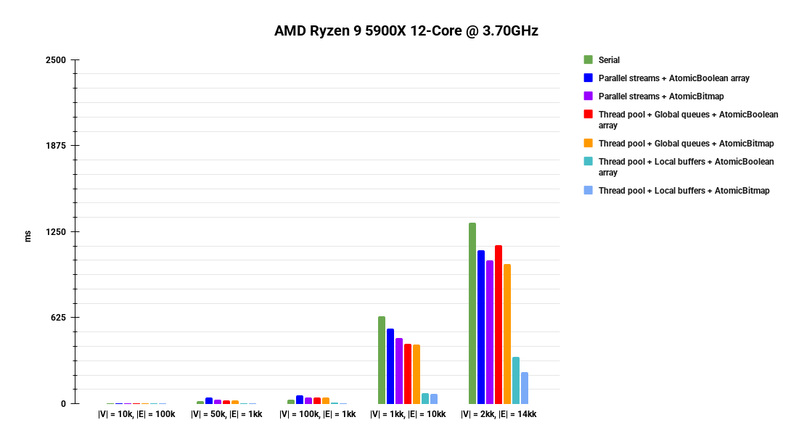

# Распараллеливание

В BFS мы гарантируем, что все вершины глубины `x` (считая от вершины старта) обработаны до первой вершины глубины `x + 1`,
поэтому, очевидно, параллельность всего BFS обеспечивается за счет параллельной обработки вершин одной и той же глубины.


# Реализация

В пакете `org.itmo.bfs` приведено шесть реализации параллельного BFS:
* с использованием параллельного `Stream API` и массива `AtomicBoolean`'ов для отметок о посещенных вершинах;
* с использованием параллельного `Stream API` и структурой `AtomicBitmap` для отметок о посещенных вершинах;
* с использованием `FixedThreadPool`, глобальными очередями вершин и массива `AtomicBoolean`'ов для отметок о посещенных вершинах;
* с использованием `FixedThreadPool`, глобальными очередями вершин и структурой `AtomicBitmap` для отметок о посещенных вершинах;
* с использованием `FixedThreadPool`, локальными буферами вершин и массива `AtomicBoolean`'ов для отметок о посещенных вершинах;
* с использованием `FixedThreadPool`, локальными буферами вершин и структурой `AtomicBitmap` для отметок о посещенных вершинах.

Структура `AtomicBitmap` представляет из себя множество битов, операции с которыми происходят атомарно.
Реализована с помощью `AtomicLongArray` (каждый `long` в массиве -- это "бакет" общего битового массива).

Для поддержания списка вершин для обработки на текущей и следующей глубинах в реализациях с глобальными очередями
используется `ConcurrentLinkedQueue`.


# Тестирование

В тестах будем проверять, были ли посещены все вершины графа.

## Производительность

В первую очередь посмотрим на производительность шести описанных реализаций. Для этого будем использовать тест `BFSTest`.
Этот тест генерирует графы различного размера, запускает на них реализации BFS и проверяет, что все вершины графа были посещены.
Также тест замеряет время работы каждого BFS.

После выполнения `50` итераций теста имеем следующую статистику для больших графов (вся статистика доступна в `/statistics`):

### AMD Ryzen 9 5900X 12-Core @ 3.70GHz:
```
------------------------------------------------------------+---------
|V| = 1_000_000, |E| = 10_000_000:                          |
Serial                                                      | 636.22
Parallel streams + Global queues + AtomicBoolean array      | 544.26
Parallel streams + Global queues + AtomicBitmap             | 477.28
Thread pool + Global queues + AtomicBoolean array           | 435.36
Thread pool + Global queues + AtomicBitmap                  | 429.34
Thread pool + Local buffers + AtomicBoolean array           | 76.64
Thread pool + Local buffers + AtomicBitmap                  | 70.84
------------------------------------------------------------+---------
|V| = 2_000_000, |E| = 14_000_000:                          |
Serial                                                      | 1312.90
Parallel streams + Global queues + AtomicBoolean array      | 1115.26
Parallel streams + Global queues + AtomicBitmap             | 1043.32
Thread pool + Global queues + AtomicBoolean array           | 1150.46
Thread pool + Global queues + AtomicBitmap                  | 1017.28
Thread pool + Local buffers + AtomicBoolean array           | 338.40
Thread pool + Local buffers + AtomicBitmap                  | 228.44
------------------------------------------------------------+---------
```



Прирост ~80-90%.

### Intel Core i7-8550U CPU 4-Core @ 1.80GHz:
```
------------------------------------------------------------+---------
|V| = 1_000_000, |E| = 10_000_000:                          |
Serial                                                      | 615.00
Parallel streams + Global queues + AtomicBoolean array      | 990.80
Parallel streams + Global queues + AtomicBitmap             | 733.00
Thread pool + Global queues + AtomicBoolean array           | 511.60
Thread pool + Global queues + AtomicBitmap                  | 292.30
Thread pool + Local buffers + AtomicBoolean array           | 414.30
Thread pool + Local buffers + AtomicBitmap                  | 138.90
------------------------------------------------------------+---------
|V| = 2_000_000, |E| = 14_000_000:                          |
Serial                                                      | 1505.00
Parallel streams + Global queues + AtomicBoolean array      | 2207.80
Parallel streams + Global queues + AtomicBitmap             | 1752.40
Thread pool + Global queues + AtomicBoolean array           | 1478.50
Thread pool + Global queues + AtomicBitmap                  | 1024.60
Thread pool + Local buffers + AtomicBoolean array           | 1582.40
Thread pool + Local buffers + AtomicBitmap                  | 696.40
------------------------------------------------------------+---------
```


Прирост ~50-80%.

Видим, что реализация на `FixedThreadPool` с локальными буферами и `AtomicBitmap` показывает себя лучше всего. Достаточно
очевидно, что общие глобальные очереди -- это основное "узкое горлышко" алгоритма.


## JCStress

В JCStress тестировать будем один этап работы BFS. Не умаляя общности, можно положить, что на рассматриваемом этапе
необходимо обработать вершины от `0` до некоторого значения `vertexCount - 1`. Будем генерировать граф на `vertexCount`
вершинах со случайным количеством ребер (минимум на 10% больше минимально возможного для связности количества).
Корректность работы будем проверять так же: проверяя, что все вершины были посещены.

Будем выполнять тесты на `20` вершинах и `2` акторах (в ином случае тесты будут слишком долгими).

Мы не будем использовать локальные буферы для тестирования в JCStress, так как их наличие полностью убирает гонку по данным
на очередях.

Реализация теста представлена в `JCStressBFSIterationTest`.

#### Запуск теста

Скачать `jcstress-latest.jar`
```shell
wget https://builds.shipilev.net/jcstress/jcstress-latest.jar
```
после чего выполнить

```shell
make jcstress
```

### Результаты

```
RUN RESULTS:
  Interesting tests: No matches.

  Failed tests: No matches.

  Error tests: No matches.
```

Все тесты прошли успешно. Полный отчет доступен в `/jcstress-results/successful`.

Попробуем что-нибудь сломать: поменяем `ConcurrentLinkedQueue` на обычный `LinkedList`.

```
                        RESULT        SAMPLES     FREQ      EXPECT  DESCRIPTION
  1048575, 0, 0, 0, 0, 0, 0, 0  8,444,949,240   83.05%  Acceptable  every vertex visited
   132490, 0, 0, 0, 0, 0, 0, 0    187,543,571    1.84%   Forbidden  No default case provided, assume Forbidden
    24588, 0, 0, 0, 0, 0, 0, 0     11,968,531    0.12%   Forbidden  No default case provided, assume Forbidden
   293922, 0, 0, 0, 0, 0, 0, 0    479,434,771    4.71%   Forbidden  No default case provided, assume Forbidden
   340116, 0, 0, 0, 0, 0, 0, 0    157,274,131    1.55%   Forbidden  No default case provided, assume Forbidden
   437795, 0, 0, 0, 0, 0, 0, 0    375,273,491    3.69%   Forbidden  No default case provided, assume Forbidden
   625670, 0, 0, 0, 0, 0, 0, 0    512,284,691    5.04%   Forbidden  No default case provided, assume Forbidden
```

Все, ожидаемо, сломалось. Полный отчет доступен в `/jcstress-results/failed`.